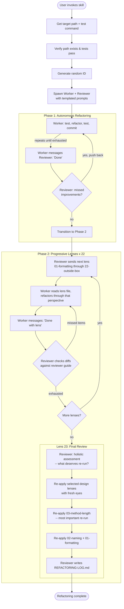

# Refactoring Team Flow

```mermaid
flowchart TD
    Start([User invokes skill]) --> Setup[Get target path + test command]
    Setup --> Verify[Verify path exists & tests pass]
    Verify --> GenID[Generate random ID]
    GenID --> Spawn[Spawn Worker + Reviewer<br/>with templated prompts]

    subgraph Phase1 [Phase 1: Autonomous Refactoring]
        W1[Worker: test, refactor, test, commit]
        W1 -->|repeats until exhausted| W1Done[Worker messages Reviewer: 'Done']
        W1Done --> R1Review{Reviewer: missed<br/>improvements?}
        R1Review -->|yes, push back| W1
        R1Review -->|no| ToPhase2[Transition to Phase 2]
    end

    Spawn --> W1

    subgraph Phase2 [Phase 2: Progressive Lenses x 22]
        SendLens[Reviewer sends next lens<br/>01-formatting through 22-outside-box]
        SendLens --> WLens[Worker reads lens file,<br/>refactors through that perspective]
        WLens --> WLensDone[Worker messages: 'Done with lens']
        WLensDone --> RLensReview{Reviewer checks diffs<br/>against reviewer guide}
        RLensReview -->|missed items| WLens
        RLensReview -->|exhausted| MoreLenses{More lenses?}
        MoreLenses -->|yes| SendLens
        MoreLenses -->|no| FinalReview
    end

    ToPhase2 --> SendLens

    subgraph FinalReview [Lens 23: Final Review]
        Assess[Reviewer: holistic assessment<br/>-- what deserves re-run?]
        Assess --> Reruns[Re-apply selected design lenses<br/>with fresh eyes]
        Reruns --> MethodLen[Re-apply 03-method-length<br/>-- most important re-run]
        MethodLen --> Surface[Re-apply 02-naming + 01-formatting]
        Surface --> WriteLog[Reviewer writes REFACTORING-LOG.md]
    end

    WriteLog --> Done([Refactoring complete])
```

Guard hook: `guard-idle-worker.sh` prevents the worker from going idle without first messaging the reviewer via SendMessage.
